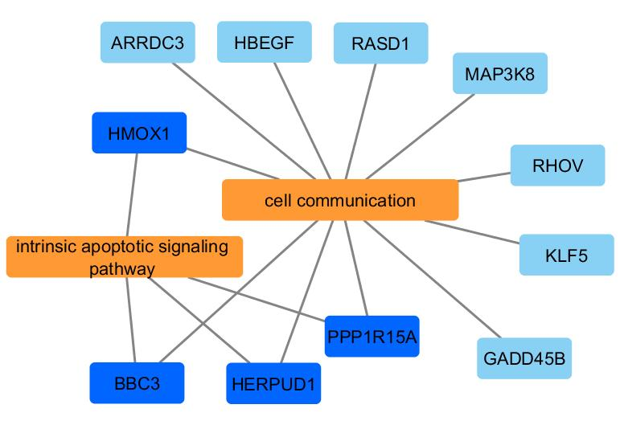
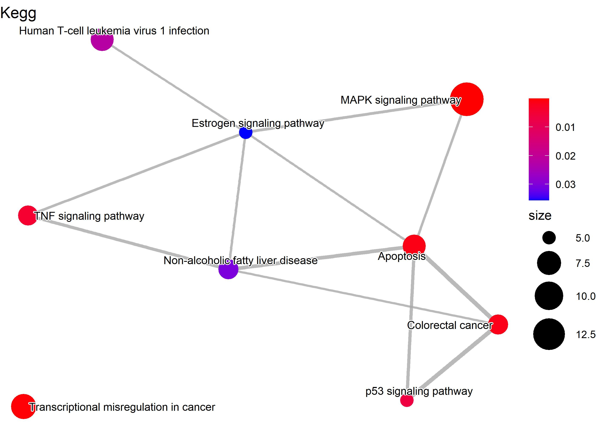
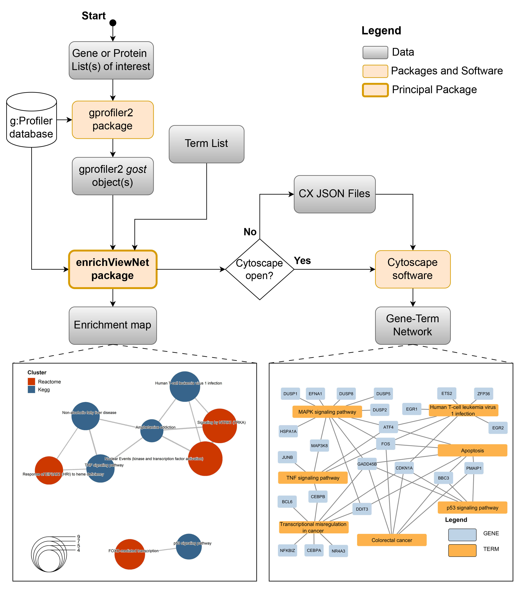
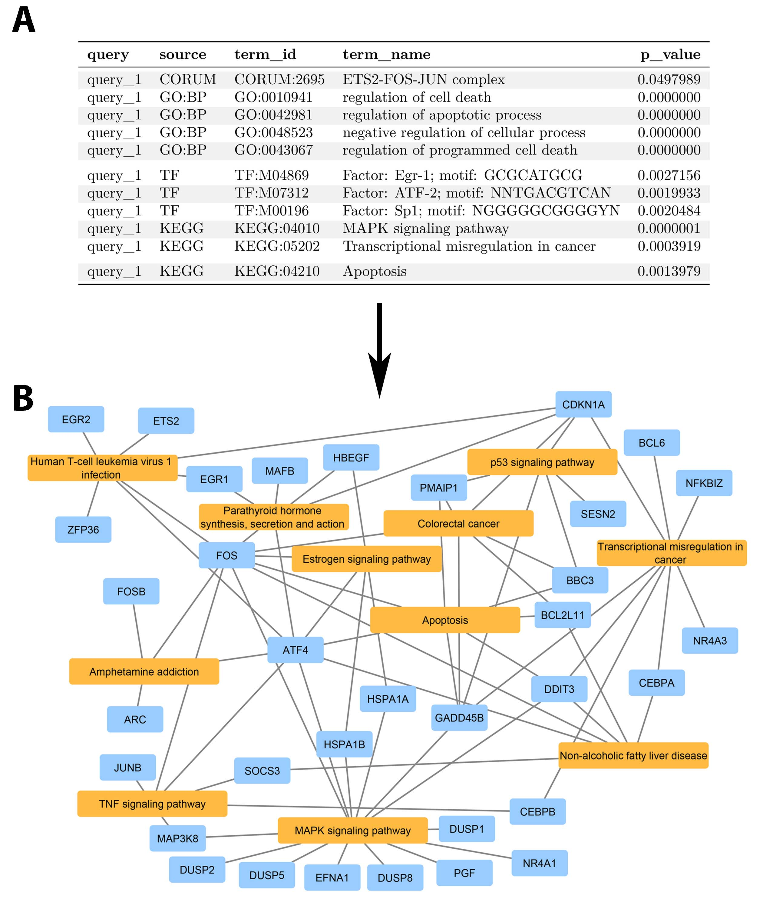
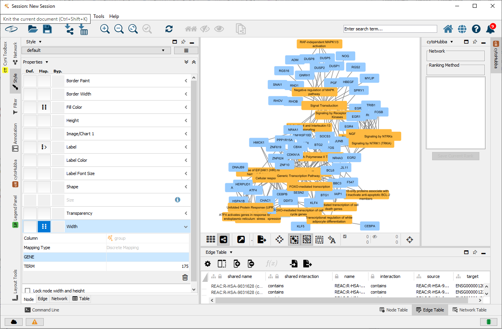
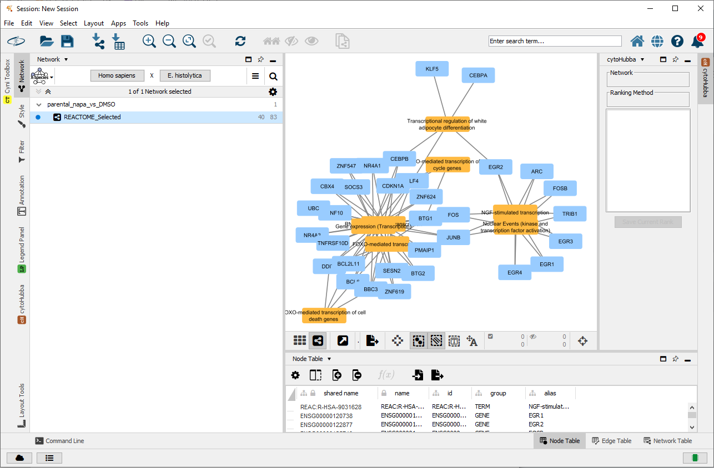
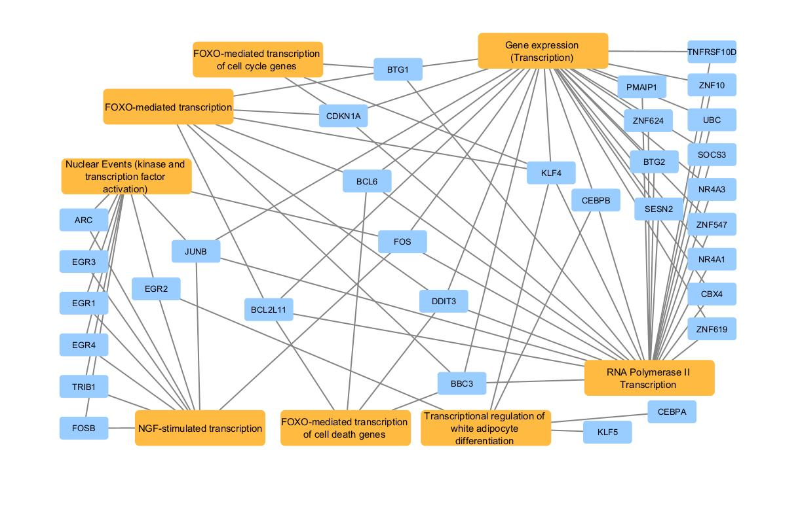

```{r style, echo = FALSE, results = 'hide', warning=FALSE, message=FALSE}
BiocStyle::markdown()

suppressPackageStartupMessages({
  library(knitr)
  library(enrichViewNet)
  library(gprofiler2)
  library(ggplot2)
})

set.seed(1214)
```

<br />
**Package**: `r Rpackage("enrichViewNet")`<br />
**Authors**: `r packageDescription("enrichViewNet")[["Author"]]`<br />
**Version**: `r packageDescription("enrichViewNet")$Version`<br />
**Compiled date**: `r Sys.Date()`<br />
**License**: `r packageDescription("enrichViewNet")[["License"]]`<br />


# Licensing 

The `r Biocpkg("enrichViewNet")` package and the underlying 
`r Biocpkg("enrichViewNet")` code are distributed under the 
Artistic license 2.0. You are free to use and redistribute this software. 

<br>
<br>

# Citing

If you use this package for a publication, we would ask you to cite the 
following:

> Deschênes A, Belleau P, Faure R, Fernandes M, Krasnitz A, Tuveson D (2023). 
  enrichViewNet: From functional enrichment results to biological networks. 
  doi:10.18129/B9.bioc.enrichViewNet, 
  https://bioconductor.org/packages/enrichViewNet. 

<br>
<br>

# Introduction

High-throughput technologies are routinely used in basic and applied 
research and are key drivers of scientific discovery. A major challenge 
in using these experimental approaches is the analysis of the large amount 
of data generated. These include lists of proteins or genes generated by 
mass spectrometry, single-cell RNA sequencing and/or microarray analysis, 
respectively. There is thus a need for robust bioinformatic and statistical 
tools that can analyze these large datasets and display the data in the form 
of networks that illustrate the biological and conceptual links with findings 
in the literature. This gap has been partially addressed by several 
bioinformatic tools that perform enrichment analysis of the data and/or 
present it in the form of networks.  

Functional enrichment analysis tools, such as _Enrichr_ [@Kuleshov2016] and 
_DAVID_ [@Dennis2003], are specialized in positioning novel findings against 
well curated data sources of biological processes and pathways. 
Most specifically, those tools identify functional gene sets that 
are statistically over- (or under-) represented in a gene list (functional 
enrichment). The traditional output of a significant enrichment analysis 
tool is a table containing 
the significant gene sets with their associated statistics. While those 
results are extremely useful, their interpretation is challenging. The visual 
representation of these results as a network can greatly facilitate the 
interpretation of the data. 

Biological network models are visual representations of various biological 
interacting elements which are based on mathematical graphs. In those 
networks, the biological elements are generally represented by nodes while 
the interactions and relationships are represented by edges. One of the 
widely used network tools in the quantitative biology community is the 
open source software _Cytoscape_ [@PaulShannon2003]. In addition of 
biological data visualization and network
analysis, _Cytoscape_ can be expended through the use of 
specialized plug-ins such as _BiNGO_ that calculates over-represented GO terms 
in a network [@Maere2005] or _CentiScaPe_ that identifies relevant network 
nodes [@Scardoni2009]. 

The _g:Profiler_ enrichment analysis tool [@Raudvere2019] is web based and has 
the particularity of being accompanied by the CRAN package 
_gprofiler2_ [@Kolberg2020]. The _gprofiler2_ package gives the opportunity to 
researchers to incorporate functional enrichment analysis into automated 
analysis pipelines written in R. This greatly facilitates research 
reproducibility. 

The **enrichViewNet** package enables the visualization 
of functional enrichment results as network graphs. Visualization of 
enriched terms aims to 
facilitate the analyses of complex results.
Compared to popular enrichment visualization graphs such as bar plots and 
dot plots, network graphs unveil the connection between the 
terms as significant terms often share one or multiple genes. Moreover, the 
**enrichViewNet** package takes advantage of a powerful network 
visualization tool which is _Cytoscape_. By doing so, all the 
functionalities of this mature software can be used to personalize 
and analyze the enrichment networks. 

First, the **enrichViewNet** package enables the 
visualization of enrichment results, in a format corresponding to the one 
generated by _gprofiler2_, as a 
customizable _Cytoscape_ network [@PaulShannon2003]. In the biological 
networks generated by **enrichViewNet**, both 
gene datasets (GO terms/pathways/protein complexes) and genes associated 
to the datasets are represented as nodes. While the edges connect each gene 
to its dataset(s). Only genes present in the query used for the
enrichment analysis are shown.


```{r graphDemo01, echo = FALSE, fig.align="center", fig.cap="A network where significant GO terms and genes are presented as nodes while edges connect each gene to its associated term(s).", out.width = '90%'}

```

The **enrichViewNet** package 
offers the option to generate a network for only a portion of the 
significant terms by selecting the source or by providing a 
specific list of terms.Once the network is created, the user can 
personalize the visual attributes 
and integrate external information such as expression profiles, phenotypes 
and other molecular states. The user can also perform network analysis.

In addition, the **enrichViewNet** package also provides the option to 
create enrichment maps from functional enrichment results. 
The enrichment maps have been introduced in the Bioconductor 
_enrichplot_ package [@Yu2022]. 
Enrichment maps enable the visualization of enriched terms into a network 
with edges connecting overlapping genes. Thus, enriched terms with overlapping 
genes cluster together. This type of graphs facilitate the 
identification of functional modules.

```{r graphDemo02, echo=FALSE, fig.align="center", fig.cap="An enrichment map using significant Kegg terms.", out.width = '95%'}

```


**enrichViewNet** has been submitted to 
[Bioconductor](https://www.bioconductor.org/) to aid researchers in carrying 
out reproducible network analyses using functional enrichment results.

<br>
<br>

# Installation

To install this package 
from [Bioconductor](https://bioconductor.org), start R 
(version 4.3 or later) and enter: 


```{r installDemo01, eval=FALSE, warning=FALSE, message=FALSE}
if (!requireNamespace("BiocManager", quietly = TRUE))
        install.packages("BiocManager")

BiocManager::install("enrichViewNet")
```

<br>
<br>


# General workflow


The following workflow gives an overview of the capabilities of 
 **enrichViewNet**:

```{r graphWorkflow, echo=FALSE, fig.align="center", fig.cap="The enrichViewNet workflow", out.width = '100%'}

```


The principal input of **enrichViewNet** is a functional enrichment 
result in a format identical to the one generated by the CRAN 
_gprofiler2_ package. 

From an enrichment result, the **enrichViewNet** offers two options:

* generate a gene-term network that can be loaded in *Cytoscape* software
* generate a enrichment map

For the gene-term network, the installation of *Cytoscape* software is 
highly recommended.

<br>
<br>

# Transforming enrichment results into a gene-term network loadable in Cytoscape


The following workflow gives an overview of the steps associated to the 
creation of an gene-term network loadable in *Cytoscape*.  

```{r graphListToGraph01, echo = FALSE, fig.align="left", fig.cap="From an enrichment list to a Cytoscape network", out.width = '100%'}

```


The key steps for the workflow are:

Step                              | Function                    
--------------------------------- | ---------------------------------------------
 Run an enrichment analysis       | `gprofiler2::gost()`
 Start *Cytoscape*                |  outside R   
 Create a gene-term network       | `createNetwork()`

The `package::function()` notation is used for functions from other packages.

<br>

## Run an enrichment analysis 

The first step consists in running an enrichment analysis with 
`r CRANpkg("gprofiler2")` package. The output of the _gprofiler2::gost()_ 
is a _list_ and should be saved. 


```{r gprofiler, echo=TRUE, warning=FALSE, message=FALSE, collapse=F, eval=TRUE}

## Required library
library(gprofiler2)

## The dataset of differentially expressed genes done between 
## napabucasin treated and DMSO control parental (Froeling et al 2019)
## All genes tested are present
data("parentalNapaVsDMSODEG")

## Retain significant results 
## (absolute fold change superior to 1 and adjusted p-value inferior to 0.05)
retained <- which(abs(parentalNapaVsDMSODEG$log2FoldChange) > 1 & 
                      parentalNapaVsDMSODEG$padj < 0.05)
signRes <-  parentalNapaVsDMSODEG[retained, ]

## Run one functional enrichment analysis using all significant genes
## The species is homo sapiens ("hsapiens")
## The g:SCS multiple testing correction method (Raudvere U et al 2019)
## The WikiPathways database is used
## Only the significant results are retained (significant=TRUE)
## The evidence codes are included in the results (evcodes=TRUE)
## A custom background included the tested genes is used
gostres <- gprofiler2::gost(
                query=list(parental_napa_vs_DMSO=unique(signRes$EnsemblID)),
                organism="hsapiens",
                correction_method="g_SCS",
                sources=c("WP"),
                significant=TRUE,
                evcodes=TRUE,
                custom_bg=unique(parentalNapaVsDMSODEG$EnsemblID))
```


<br>

The gost() function returns an named list of 2 entries: 

* The __result__ entry contains the enrichment results.
* The __meta__ entry contains the metadata information.

<br>

```{r gostResult, echo=TRUE, eval=TRUE}
## The 'gostres' object is a list of 2 entries
## The 'result' entry contains the enrichment results
## The 'meta' entry contains the metadata information

## Some columns of interest in the results
gostres$result[1:4, c("query", "p_value", "term_size", 
                    "query_size", "intersection_size", "term_id")]

## The term names can be longer than the one shown
gostres$result[19:22, c("term_id", "source", "term_name")]

```

<br>

## Start Cytoscape

[Cytoscape](https://cytoscape.org/) is an open source software for 
visualizing networks. It enables network integration with any type of attribute
data. The Cytoscape software 
is available at the [Cytoscape website](https://cytoscape.org/).

```{r cytoscapeLogo01, echo = FALSE, fig.align="center", fig.cap="Cytoscape software logo.", out.width = '75%'}

```

The Cytoscape network generated by 
`r Githubpkg("adeschen/enrichViewNet")` 
will be automatically loaded into the [Cytoscape](https://cytoscape.org/) 
software when the application is running.

If the application is not running, a CX JSON file will be created. The file 
can then be loaded manually into the [Cytoscape](https://cytoscape.org/) 
software.

<br>

## Create a gene-term network 

The gene-term network can be created with the _createNetwork()_ function. If 
_Cytoscape_ is opened, the network should automatically be loaded in the 
application. Otherwise, a CX JSON file is created. The CX JSON can be manually 
be opened in _Cytoscape_.


The following figure shows what the gene-term network looks like 
in _Cytoscape_. As there are numerous significant Reactome terms, the network 
is a bit hectic.

```{r runCreateNetwork, echo=TRUE, eval=TRUE, message=FALSE}
## Load saved enrichment results between parental Napa vs DMSO
data("parentalNapaVsDMSOEnrichment")

## Create network for REACTOME significant terms
## The 'removeRoot=TRUE' parameter removes the root term from the network
## The network will either by created in Cytoscape (if the application is open)
## or a CX file will be created in the temporary directory
createNetwork(gostObject=parentalNapaVsDMSOEnrichment,  source="REAC", 
        removeRoot=TRUE, title="REACTOME_All", 
        collection="parental_napa_vs_DMSO", 
        fileName=file.path(tempdir(), "parentalNapaVsDMSOEnrichment.cx"))
```

<br>

This is an example of the Reactome network in _Cytoscape_.

```{r networkInCytoscape, echo=FALSE, fig.align="center", fig.cap="All reactome terms in a gene-term network loaded in Cytoscape.", out.width = '110%'}

```

<br>

To address this situation, a updated gene-term network containing only 
Reactome terms of interest is created.

<br>

```{r runCreateNetworkSelected, echo=TRUE, eval=TRUE, message=FALSE}
## Load saved enrichment results between parental Napa vs DMSO
data("parentalNapaVsDMSOEnrichment")

## List of terms of interest
reactomeSelected <- c("REAC:R-HSA-9031628", "REAC:R-HSA-198725", 
                        "REAC:R-HSA-9614085", "REAC:R-HSA-9617828",
                        "REAC:R-HSA-9614657", "REAC:R-HSA-73857",
                        "REAC:R-HSA-74160", "REAC:R-HSA-381340")

## All enrichment results
results <- parentalNapaVsDMSOEnrichment$result

## Retain selected results
selectedRes <- results[which(results$term_id %in% reactomeSelected), ]

## Print the first selected terms
selectedRes[, c("term_name")]

```

<br>

```{r runCreateNetworkSelected2, echo=TRUE, eval=TRUE, message=FALSE, fig.align="center", fig.cap="Enrichment map."}

## Create network for REACTOME selected terms
## The 'source="TERM_ID"' parameter enable to specify a personalized 
## list of terms of interest
## The network will either by created in Cytoscape (if the application is open)
## or a CX file will be created in the temporary directory
createNetwork(gostObject=parentalNapaVsDMSOEnrichment,  source="TERM_ID", 
          termIDs=selectedRes$term_id, title="REACTOME_Selected", 
          collection="parental_napa_vs_DMSO",
          fileName=file.path(tempdir(), 
            "parentalNapaVsDMSOEnrichment_REACTOME.cx"))
```

<br>

The updated Reactome network in _Cytoscape_.

```{r networkInCytoscapeSelected, echo=FALSE, fig.align="center", fig.cap="Selected Reactome terms in a gene-term network loaded in Cytoscape.", out.width = '110%'}

```

<br>

In _Cytoscape_, the appearance of a network is easily customized. As example, 
default color and shape for all nodes can be modified. For this example, 
the nodes have been moved to clarify their relation with the Reactome terms.


```{r networkFinalReactome, echo=FALSE, fig.align="center", fig.cap="Final Reactome network after customization inside Cytoscape.", out.width = '100%'}

```

<br>

The final Reactome network, after customization inside Cytoscape, shows that 
multiple transcription enriched terms (*FOXO-mediated transcription*, 
*FOXO-mediated transcription of cell cycle genes*, 
_transcription regulation of white adipocyte differentiation_, 
_RNA polymerase II transcription_ and 
_NGF-stimulated transcription_ terms) are linked through enriched genes.

<br>
<br>


# Transforming enrichment results into an enrichment map


The following workflow gives an overview of the steps associated to the 
creation of an enrichment map. 

The key steps for the workflow are:

Step                              | Function                    
--------------------------------- | ---------------------------------------------
 Run an enrichment analysis       | `gprofiler2::gost()`
 Create an enrichment map         | `createEnrichMap()`

The `package::function()` notation is used for functions from other packages.

<br>


## Run an enrichment analysis 

The first step consists in running an enrichment analysis with 
`r CRANpkg("gprofiler2")` package. The output of the _gprofiler2::gost()_ 
is a _list_ and should be saved. 


```{r gprofiler2, echo=TRUE, warning=FALSE, message=FALSE, collapse=F, eval=TRUE}

## Required library
library(gprofiler2)

## The dataset of differentially expressed genes done between 
## napabucasin treated and DMSO control parental (Froeling et al 2019)
## All genes tested are present
data("parentalNapaVsDMSODEG")

## Retain significant results 
## (absolute fold change superior to 1 and adjusted p-value inferior to 0.05)
retained <- which(abs(parentalNapaVsDMSODEG$log2FoldChange) > 1 & 
                      parentalNapaVsDMSODEG$padj < 0.05)
signRes <-  parentalNapaVsDMSODEG[retained, ]

## Run one functional enrichment analysis using all significant genes
## The species is homo sapiens ("hsapiens")
## The g:SCS multiple testing correction method (Raudvere U et al 2019)
## The WikiPathways database is used
## Only the significant results are retained (significant=TRUE)
## The evidence codes are included in the results (evcodes=TRUE)
## A custom background included the tested genes is used
gostres <- gprofiler2::gost(
                query=list(parental_napa_vs_DMSO=unique(signRes$EnsemblID)),
                organism="hsapiens",
                correction_method="g_SCS",
                sources=c("WP"),
                significant=TRUE,
                evcodes=TRUE,
                custom_bg=unique(parentalNapaVsDMSODEG$EnsemblID))
```


<br>

The gost() function returns an named list of 2 entries: 

* The __result__ entry contains the enrichment results.
* The __meta__ entry contains the metadata information.

<br>

```{r gostResult2, echo=TRUE, eval=TRUE}
## The 'gostres' object is a list of 2 entries
## The 'result' entry contains the enrichment results
## The 'meta' entry contains the metadata information

## Some columns of interest in the results
gostres$result[1:4, c("query", "p_value", "term_size", 
                    "query_size", "intersection_size", "term_id")]

## The term names can be longer than the one shown
gostres$result[19:22, c("term_id", "source", "term_name")]

```

<br>


## Create an enrichment map 

The enrichment map can be created with the _createEnrichMap()_ function. The 
function generates a _ggplot_ object.

In an enrichment map, terms with overlapping significant genes tend to 
cluster together. The Jaccard correlation coefficient is used as a metric of 
similarity. Terms with high similarity (similarity metric > 0.2) are linked 
together by edges. The edges are shorter and thicker when the similarity 
metric is high. 

```{r runCreateEmap01, echo=TRUE, eval=TRUE, fig.cap="A Kegg enrichment map where terms with overlapping significant genes cluster together.", fig.align="center"}

## Load saved enrichment results between parental Napa vs DMSO
data(parentalNapaVsDMSOEnrichment)

## Set seed to ensure reproducible results
set.seed(121)

## Create network for all Kegg terms
createEnrichMap(gostObject=parentalNapaVsDMSOEnrichment, 
                  query="parental_napa_vs_DMSO", 
                  source="KEGG")
    
```


<br>

The Kegg enrichment map shows that the _MAPK signaling pathway_ term is 
highly influential in the network. In addition, the 
_Transcriptional misregulation in cancer_ term is the only isolated node.

<br>

### Effect of _seed_ value

The layering of the nodes is not always optimal. As the layering is affected by 
the _seed_ value, you might want to test few _seed_ values, using the 
_set.seed()_ function, before selecting the final graph.


```{r runCreateEmap02, echo=TRUE, eval=TRUE, message=FALSE, warning=FALSE, fig.cap="An enrichment map with personalized colors.", fig.align="center"}

## Set seed to ensure reproducible results
set.seed(91)

## Create network for all Kegg terms
createEnrichMap(gostObject=parentalNapaVsDMSOEnrichment, 
                  query="parental_napa_vs_DMSO", 
                  source="KEGG")
    
```

<br>

### Enrichment map customization


The output of the _createEnrichMap()_ function is a _ggplot_ object. 
This means that the graph can be personalized. For example, the default 
colors can be changed:


```{r runCreateEmap03, echo=TRUE, eval=TRUE, message=FALSE, warning=FALSE, fig.cap="An enrichment map with personalized colors.", fig.align="center"}

## The ggplot2 library is required
library(ggplot2)

## Set seed to ensure reproducible results
set.seed(91)

## Create network for all Kegg terms
graphKegg <- createEnrichMap(gostObject=parentalNapaVsDMSOEnrichment, 
                  query="parental_napa_vs_DMSO", 
                  source="KEGG")

## Nodes with lowest p-values will be in orange and highest p-values in black
## The title of the legend is also modified
graphKegg + scale_fill_gradient(name="P-value adjusted", low="orange", 
                                    high="black")
    
```

<br>
<br>


# Transforming enrichment results into an enrichment map with groups


The following workflow gives an overview of the steps associated to the 
creation of an enrichment map with groups. Groups can be created from the 
same enrichment analysis or can come from different enrichment analyses.

The key steps for the workflow are:

Step                                           | Function                    
---------------------------------------------- | ------------------------------
 Run one or multiple enrichment analyses       | `gprofiler2::gost()`
 Create an enrichment map                      | `createEnrichMapMulti()`

The `package::function()` notation is used for functions from other packages.

<br>

The first step has been presented in the previous section.

<br>

## Create an enrichment map using multiple enrichment analyses


```{r emapMulti01, echo=TRUE, warning=FALSE, message=FALSE, collapse=F, eval=TRUE}

## Set seed to ensure reproducible results
set.seed(2121)

## The dataset of functional enriched terms for two experiments:
## napabucasin treated and DMSO control parental and
## napabucasin treated and DMSO control expressing Rosa26 control vector
## (Froeling et al 2019)
data("parentalNapaVsDMSOEnrichment")
data("rosaNapaVsDMSOEnrichment")

## The gostObjectList is a list containing all 
## the functional enrichment objects
gostObjectList <- list(parentalNapaVsDMSOEnrichment, 
    rosaNapaVsDMSOEnrichment)

## The queryList is a list of query names retained for each of the enrichment 
## object (same order). Beware that a enrichment object can contain more than 
## one query.
query_01 <- unique(parentalNapaVsDMSOEnrichment$result$query)[1]
query_02 <- unique(rosaNapaVsDMSOEnrichment$result$query)[1]
queryList <- list(query_01, query_02)

## Enrichment map where the groups are the KEGG results for the 2 different
## experiments
createEnrichMapMulti(gostObjectList=gostObjectList,
    queryList=queryList, source="KEGG", removeRoot=TRUE)
    

```


<br>

There are 4 KEGG enrichment terms that are shared by the 2 experiments. 
In additions, the _Viral carinogenesis_ term is the only term that is not 
related to the other KEGG terms.

<br>

### Effect of _seed_ value

The layering of the nodes is not always optimal. As the layering is affected by 
the _seed_ value, you might want to test few _seed_ values, using the 
_set.seed()_ function, before selecting the final graph.


```{r emapMulti02, echo=TRUE, eval=TRUE, message=FALSE, warning=FALSE, fig.cap="An enrichment map with a different seed.", fig.align="center"}


## Set seed to ensure reproducible results
set.seed(5)

## Enrichment map where the groups are the KEGG results for the 2 different
## experiments
createEnrichMapMulti(gostObjectList=gostObjectList,
    queryList=queryList, source="KEGG", removeRoot=TRUE)
    
```

<br>

### Enrichment map customization


The output of the _createEnrichMapMulti()_ function is a _ggplot_ object. 
This means that the graph can be personalized. For example, the default 
colors, legend title and legend font can be changed:

```{r emapMulti03, echo=TRUE, warning=FALSE, message=FALSE, collapse=F, eval=TRUE, fig.cap="An enrichment map with different colors."}

## Required library
library(ggplot2)

## Set seed to ensure reproducible results
set.seed(2121)

## Enrichment map where the groups are the KEGG results for the 2 different
## experiments
createEnrichMapMulti(gostObjectList=gostObjectList,
    queryList=queryList, source="KEGG", removeRoot=TRUE) + 
        scale_fill_manual(name="Groups",
                            breaks = queryList,
                            values = c("cyan4", "bisque3"),
                            labels = c("parental", "rosa")) +
        theme(legend.title = element_text(face="bold"))

```


<br>
<br>


# Acknowledgments

The differentially expressed genes between napabucasin-treated cells (0.5 uM) 
and DMSO as vehicle control are reprinted from 
Clinical Cancer Research, 2019, 25 (23), 7162–7174, 
Fieke E.M. Froeling, Manojit Mosur Swamynathan, Astrid Deschênes, 
Iok In Christine Chio, Erin Brosnan, Melissa A. Yao, Priya Alagesan, 
Matthew Lucito, Juying Li, An-Yun Chang, Lloyd C. Trotman, Pascal Belleau, 
Youngkyu Park, Harry A. Rogoff, James D. Watson, David A. Tuveson, 
Bioactivation of napabucasin triggers reactive oxygen species–mediated 
cancer cell death, with permission from AACR.

Robert L. Faure is also supported by the National Sciences Engineering 
Research Council of Canada (NSERCC): 155751-1501.

<br>
<br>

# Session info

Here is the output of sessionInfo() on the system on which this document 
was compiled:

```{r sessionInfo, echo=FALSE}
sessionInfo()
```


<br>
<br>

# References


