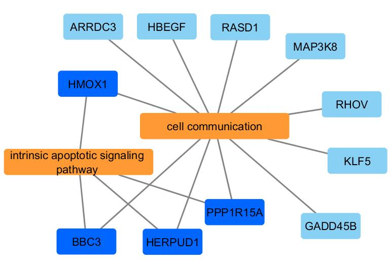
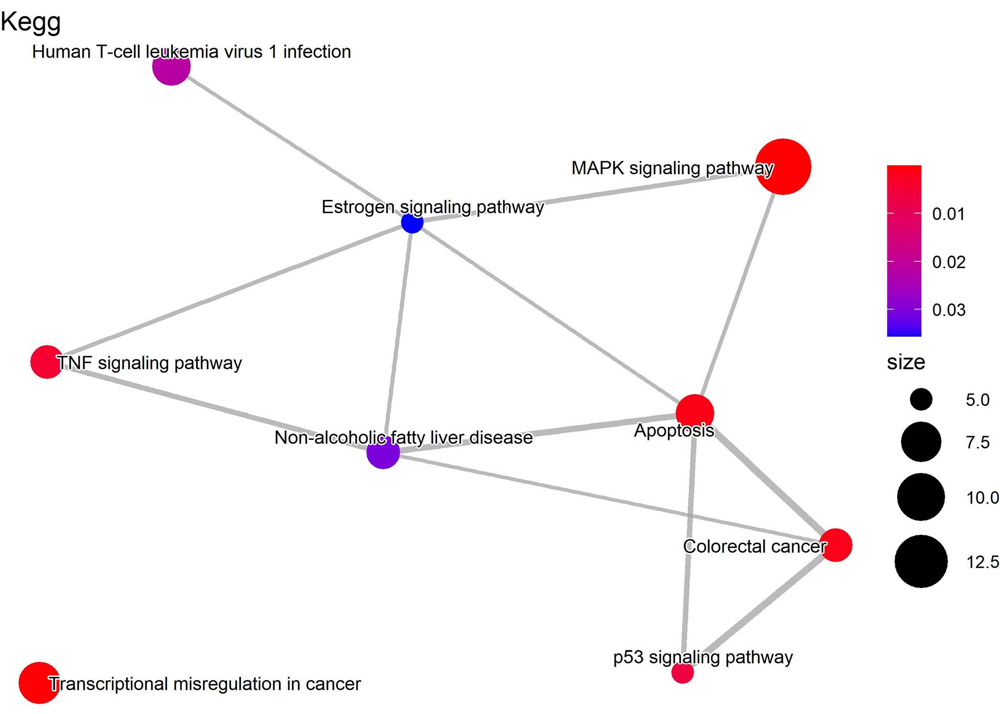
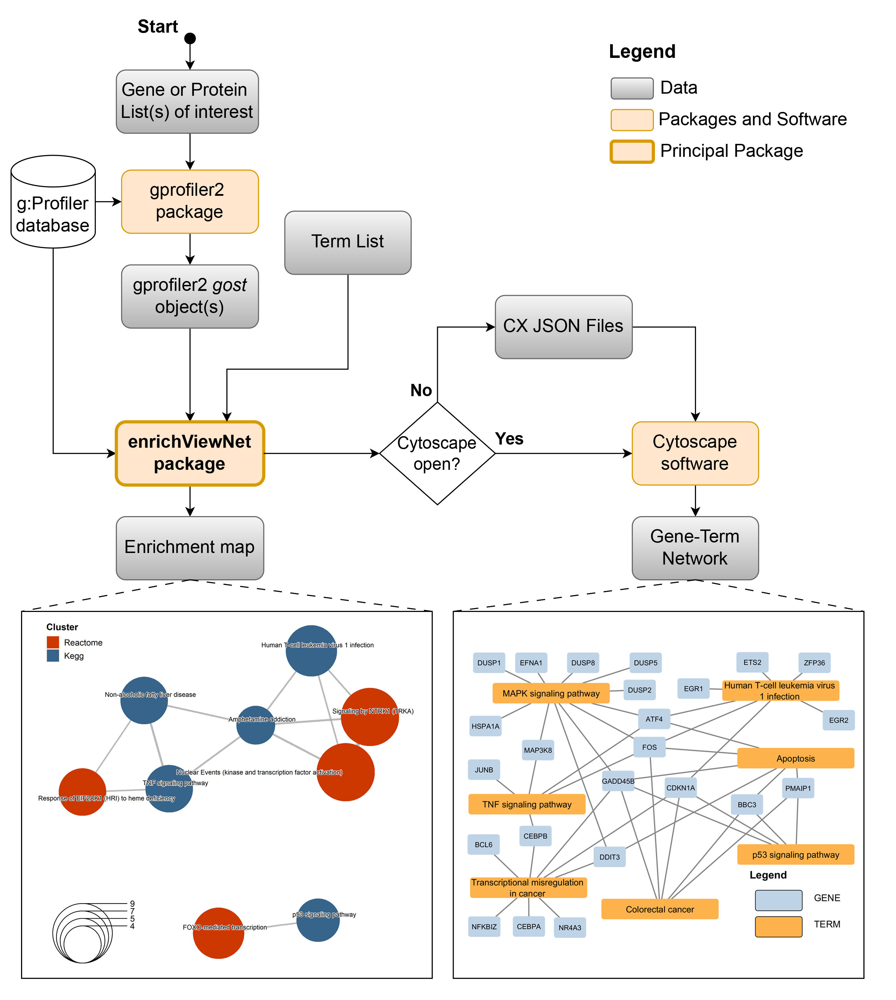
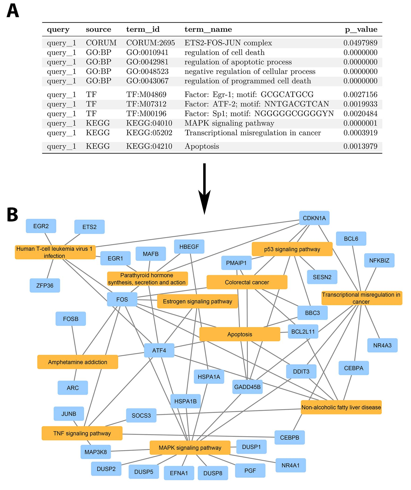
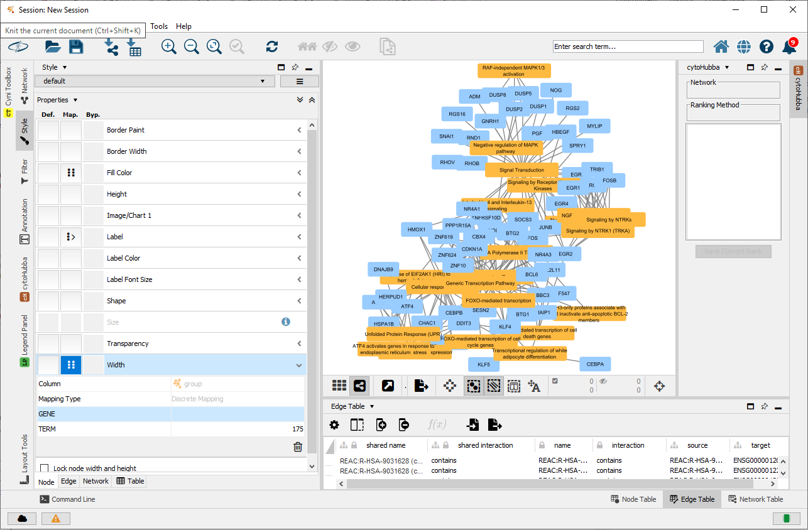
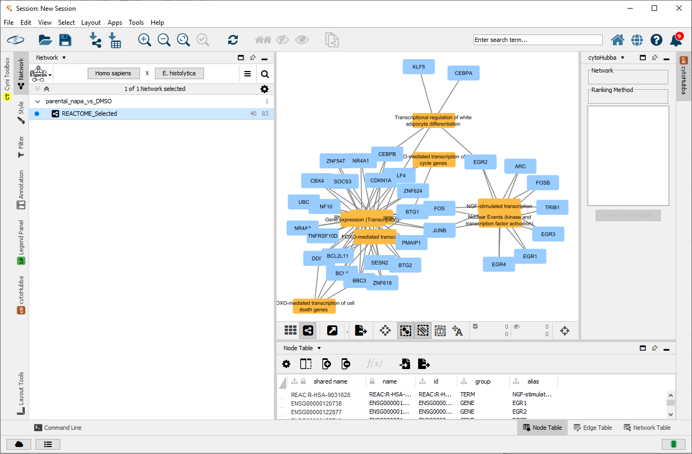
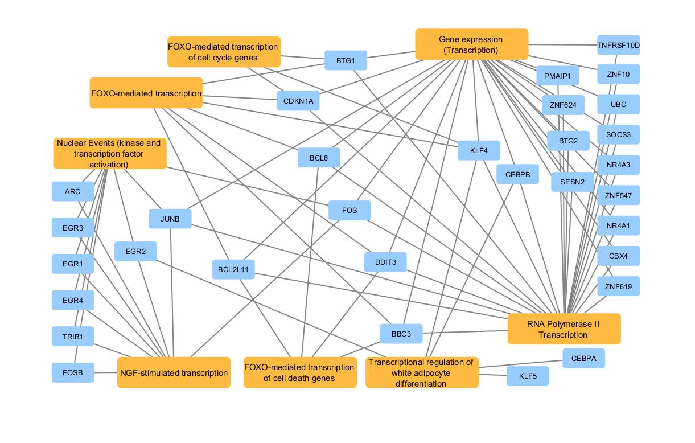

```{r style, echo = FALSE, results = 'hide', warning=FALSE, message=FALSE}
BiocStyle::markdown()

suppressPackageStartupMessages({
    library(knitr)
    library(enrichViewNet)
    library(gprofiler2)
    library(ggplot2)
    library(igraph)
    library(ggtangle)
    library(ggrepel)
})

## Set it globally
options(ggrepel.max.overlaps = 100)

set.seed(1214)
```

<br />
**Package**: `r Rpackage("enrichViewNet")`<br />
**Authors**: `r packageDescription("enrichViewNet")[["Author"]]`<br />
**Version**: `r packageDescription("enrichViewNet")$Version`<br />
**Compiled date**: `r Sys.Date()`<br />
**License**: `r packageDescription("enrichViewNet")[["License"]]`<br />


# Licensing 

The `r Biocpkg("enrichViewNet")` package and the underlying 
`r Biocpkg("enrichViewNet")` code are distributed under the 
Artistic license 2.0. You are free to use and redistribute this software. 

<br>
<br>

# Citing

If you use this package for a publication, we would ask you to cite on of the  
following references. 

This reference describes both gene-term networks and enrichment maps:

> Deschênes, A., Belleau, P., Faure, R. L., Fernandes, M. J., Krasnitz, A., & 
    Tuveson, D. A. (2024, September 13). Visualization of functional 
    enrichment results into biological networks with Bioconductor 
    enrichViewNet package. BioC2024: Where Software and Biology Connect 
    (BioC2024), Grand Rapids, MI, Van Andel Institute. Zenodo. 
    https://doi.org/10.5281/zenodo.13755900

<br>
This reference is specific to enrichment maps:
<br>

> Deschênes,A., Nigri, J., Tuveson, D. A. (2026) Myofibroblasts 
   induce neuroplasticity to promote pancreatic inflammation and cancer 
   progression [Functional Enrichment on PCSs Differentially Expressed Genes 
   from Mucciolo G. et al 2024] [Source Code]. 
   https://doi.org/10.24433/CO.2493140.v1

<br>


# Introduction

High-throughput technologies are routinely used in basic and applied 
research and are key drivers of scientific discovery. A major challenge 
in using these experimental approaches is the analysis of the large amount 
of data generated. These include lists of proteins or genes generated by 
mass spectrometry, single-cell RNA sequencing and/or microarray analysis, 
respectively. There is thus a need for robust bioinformatic and statistical 
tools that can analyze these large datasets and display the data in the form 
of networks that illustrate the biological and conceptual links with findings 
in the literature. This gap has been partially addressed by several 
bioinformatic tools that perform enrichment analysis of the data and/or 
present it in the form of networks.  

Functional enrichment analysis tools, such as _Enrichr_ [@Kuleshov2016] and 
_DAVID_ [@Dennis2003], are specialized in positioning novel findings against 
well curated data sources of biological processes and pathways. 
Most specifically, those tools identify functional gene sets that 
are statistically over- (or under-) represented in a gene list (functional 
enrichment). The traditional output of a significant enrichment analysis 
tool is a table containing 
the significant gene sets with their associated statistics. While those 
results are extremely useful, their interpretation is challenging. The visual 
representation of these results as a network can greatly facilitate the 
interpretation of the data. 

Biological network models are visual representations of various biological 
interacting elements which are based on mathematical graphs. In those 
networks, the biological elements are generally represented by nodes while 
the interactions and relationships are represented by edges. One of the 
widely used network tools in the quantitative biology community is the 
open source software _Cytoscape_ [@PaulShannon2003]. In addition of 
biological data visualization and network
analysis, _Cytoscape_ can be expended through the use of 
specialized plug-ins such as _BiNGO_ that calculates over-represented GO terms 
in a network [@Maere2005] or _CentiScaPe_ that identifies relevant network 
nodes [@Scardoni2009]. 

The _g:Profiler_ enrichment analysis tool [@Raudvere2019] is web based and has 
the particularity of being accompanied by the CRAN package 
_gprofiler2_ [@Kolberg2020]. The _gprofiler2_ package gives the opportunity to 
researchers to incorporate functional enrichment analysis into automated 
analysis pipelines written in R. This greatly facilitates research 
reproducibility. 

The **enrichViewNet** package enables the visualization 
of functional enrichment results as network graphs. Visualization of 
enriched terms aims to 
facilitate the analyses of complex results.
Compared to popular enrichment visualization graphs such as bar plots and 
dot plots, network graphs unveil the connection between the 
terms as significant terms often share one or multiple genes. Moreover, the 
**enrichViewNet** package takes advantage of a powerful network 
visualization tool which is _Cytoscape_. By doing so, all the 
functionalities of this mature software can be used to personalize 
and analyze the enrichment networks. 

First, the **enrichViewNet** package enables the 
visualization of enrichment results, in a format corresponding to the one 
generated by _gprofiler2_, as a 
customizable _Cytoscape_ network [@PaulShannon2003]. In the biological 
networks generated by **enrichViewNet**, both 
gene datasets (GO terms/pathways/protein complexes) and genes associated 
to the datasets are represented as nodes. While the edges connect each gene 
to its dataset(s). Only genes present in the query used for the
enrichment analysis are shown.


```{r graphDemo01, echo = FALSE, fig.align="center", fig.cap="A network where significant GO terms and genes are presented as nodes while edges connect each gene to its associated term(s).", out.width = '90%'}

```

The **enrichViewNet** package 
offers the option to generate a network for only a portion of the 
significant terms by selecting the source or by providing a 
specific list of terms.Once the network is created, the user can 
personalize the visual attributes 
and integrate external information such as expression profiles, phenotypes 
and other molecular states. The user can also perform network analysis.

In addition, the **enrichViewNet** package also provides the option to 
create enrichment maps from functional enrichment results. 
The enrichment maps have been introduced in the Bioconductor 
_enrichplot_ package [@Yu2022]. 
Enrichment maps enable the visualization of enriched terms into a network 
with edges connecting overlapping genes. Thus, enriched terms with overlapping 
genes cluster together. This type of graphs facilitate the 
identification of functional modules.

```{r graphDemo02, echo=FALSE, fig.align="center", fig.cap="An enrichment map using significant Kegg terms where edges are connecting terms with overlapping genes.", out.width = '95%'}

```


**enrichViewNet** has been submitted to 
[Bioconductor](https://www.bioconductor.org/) to aid researchers in carrying 
out reproducible network analyses using functional enrichment results.

<br>
<br>

# Installation

To install this package 
from [Bioconductor](https://bioconductor.org), start R 
(version 4.3 or later) and enter: 


```{r installDemo01, eval=FALSE, warning=FALSE, message=FALSE}
if (!requireNamespace("BiocManager", quietly = TRUE))
        install.packages("BiocManager")

BiocManager::install("enrichViewNet")
```

<br>
<br>


# General workflow


The following workflow gives an overview of the capabilities of 
**enrichViewNet**:

```{r graphWorkflow, echo=FALSE, fig.align="center", fig.cap="The enrichViewNet general workflow", out.width = '100%'}

```


The principal input of **enrichViewNet** is a functional enrichment 
result in a format identical to the one generated by the CRAN 
_gprofiler2_ package. 

From an enrichment result, the **enrichViewNet** offers two options:

* generate a gene-term network that can be loaded in *Cytoscape* software
* generate a enrichment map

For the gene-term network, the installation of *Cytoscape* software is 
highly recommended.

<br>
<br>

# Gene-Term network loadable in Cytoscape


The following workflow gives an overview of the steps associated to the 
creation of an gene-term network loadable in *Cytoscape*.  

```{r graphListToGraph01, echo = FALSE, fig.align="left", fig.cap="From an enrichment list (A) to a Cytoscape network (B).", out.width = '100%'}

```


The key steps for the workflow are:

Step                             | Function                    
-------------------------------- | --------------------------------------------
Run an enrichment analysis       | `gprofiler2::gost()`
Start *Cytoscape*                |  outside R   
Create a gene-term network       | `createNetwork()`

The `package::function()` notation is used for functions from other packages.

<br>

## Run an enrichment analysis 

The first step consists in running an enrichment analysis with 
`r CRANpkg("gprofiler2")` package. The output of the _gprofiler2::gost()_ 
is a _list_ and should be saved. 


```{r gprofiler, echo=TRUE, warning=FALSE, message=FALSE, collapse=F, eval=TRUE}

## Required library
library(gprofiler2)

## The dataset of differentially expressed genes done between 
## napabucasin treated and DMSO control parental (Froeling et al 2019)
## All genes tested are present
data("parentalNapaVsDMSODEG")

## Retain significant results 
## (absolute fold change superior to 1 and adjusted p-value inferior to 0.05)
retained <- which(abs(parentalNapaVsDMSODEG$log2FoldChange) > 1 & 
                            parentalNapaVsDMSODEG$padj < 0.05)
signRes <-  parentalNapaVsDMSODEG[retained, ]

## Run one functional enrichment analysis using all significant genes
## The species is homo sapiens ("hsapiens")
## The g:SCS multiple testing correction method (Raudvere U et al 2019)
## The WikiPathways database is used
## Only the significant results are retained (significant=TRUE)
## The evidence codes are included in the results (evcodes=TRUE)
## A custom background included the tested genes is used
gostres <- gprofiler2::gost(
                query=list(parental_napa_vs_DMSO=unique(signRes$EnsemblID)),
                organism="hsapiens",
                correction_method="g_SCS",
                sources=c("WP"),
                significant=TRUE,
                evcodes=TRUE,
                custom_bg=unique(parentalNapaVsDMSODEG$EnsemblID))
```


<br>

The gost() function returns an named list of 2 entries: 

* The __result__ entry contains the enrichment results.
* The __meta__ entry contains the metadata information.

<br>

```{r gostResult, echo=TRUE, eval=TRUE}
## The 'gostres' object is a list of 2 entries
## The 'result' entry contains the enrichment results
## The 'meta' entry contains the metadata information

## Some columns of interest in the results
gostres$result[1:4, c("query", "p_value", "term_size", 
                    "query_size", "intersection_size", "term_id")]

## The term names can be longer than the one shown
gostres$result[19:22, c("term_id", "source", "term_name")]

```

<br>

## Start Cytoscape

[Cytoscape](https://cytoscape.org/) is an open source software for 
visualizing networks. It enables network integration with any type of attribute
data. The Cytoscape software 
is available at the [Cytoscape website](https://cytoscape.org/).

```{r cytoscapeLogo01, echo = FALSE, fig.align="center", fig.cap="Cytoscape software logo.", out.width = '55%'}

```

The Cytoscape network generated by 
`r Githubpkg("adeschen/enrichViewNet")` 
will be automatically loaded into the [Cytoscape](https://cytoscape.org/) 
software when the application is running.

If the application is not running, a CX JSON file will be created (standard 
Cytoscape file format). The file can then be loaded manually into 
the [Cytoscape](https://cytoscape.org/) software.

<br>

## Create a gene-term network 

The gene-term network can be created with the _createNetwork()_ function. If 
_Cytoscape_ is opened, the network should automatically be loaded in the 
application. Otherwise, a CX JSON file is created. The CX JSON can be manually 
be opened in _Cytoscape_.


The following figure shows what the gene-term network looks like 
in _Cytoscape_. As there are numerous significant Reactome terms, the network 
is a bit hectic.

```{r runCreateNetwork, echo=TRUE, eval=TRUE, message=FALSE}
## Load saved enrichment results between parental Napa vs DMSO
data("parentalNapaVsDMSOEnrichment")

## Create network for REACTOME significant terms
## The 'removeRoot=TRUE' parameter removes the root term from the network
## The network will either by created in Cytoscape (if the application is open)
## or a CX file will be created in the temporary directory
createNetwork(gostObject=parentalNapaVsDMSOEnrichment,  source="REAC", 
        removeRoot=TRUE, title="REACTOME_All", 
        collection="parental_napa_vs_DMSO", 
        fileName=file.path(tempdir(), "parentalNapaVsDMSOEnrichment.cx"))
```

<br>

This is an example of the Reactome network in _Cytoscape_.

```{r networkInCytoscape, echo=FALSE, fig.align="center", fig.cap="All reactome terms in a gene-term network loaded in Cytoscape.", out.width = '110%'}

```

<br>

To address this situation, an updated gene-term network containing only 
Reactome terms of interest is created.

<br>

```{r runCreateNetworkSelected, echo=TRUE, eval=TRUE, message=FALSE}
## Load saved enrichment results between parental Napa vs DMSO
data("parentalNapaVsDMSOEnrichment")

## List of terms of interest
reactomeSelected <- c("REAC:R-HSA-9031628", "REAC:R-HSA-198725", 
                        "REAC:R-HSA-9614085", "REAC:R-HSA-9617828",
                        "REAC:R-HSA-9614657", "REAC:R-HSA-73857",
                        "REAC:R-HSA-74160", "REAC:R-HSA-381340")

## All enrichment results
results <- parentalNapaVsDMSOEnrichment$result

## Retain selected results
selectedRes <- results[which(results$term_id %in% reactomeSelected), ]

## Print the first selected terms
selectedRes[, c("term_name")]

```

<br>

```{r runCreateNetworkSelected2, echo=TRUE, eval=TRUE, message=FALSE, fig.align="center", fig.cap="Enrichment map."}

## Create network for REACTOME selected terms
## The 'source="TERM_ID"' parameter enable to specify a personalized 
## list of terms of interest
## The network will either by created in Cytoscape (if the application is open)
## or a CX file will be created in the temporary directory
createNetwork(gostObject=parentalNapaVsDMSOEnrichment,  source="TERM_ID", 
        termIDs=selectedRes$term_id, title="REACTOME_Selected", 
        collection="parental_napa_vs_DMSO",
        fileName=file.path(tempdir(), "parentalNapaVsDMSO_REACTOME.cx"))
```

<br>

The updated Reactome network in _Cytoscape_.

```{r networkInCytoscapeSelected, echo=FALSE, fig.align="center", fig.cap="Selected Reactome terms in a gene-term network loaded in Cytoscape.", out.width = '110%'}

```

<br>

In _Cytoscape_, the appearance of a network is easily customized. As example, 
default color and shape for all nodes can be modified. For this example, 
the nodes have been moved to clarify their relation with the Reactome terms.


```{r networkFinalReactome, echo=FALSE, fig.align="center", fig.cap="Final Reactome network after customization inside Cytoscape.", out.width = '100%'}

```

<br>

The final Reactome network, after customization inside Cytoscape, shows that 
multiple transcription enriched terms (*FOXO-mediated transcription*, 
*FOXO-mediated transcription of cell cycle genes*, 
_transcription regulation of white adipocyte differentiation_, 
_RNA polymerase II transcription_ and 
_NGF-stimulated transcription_ terms) are linked through enriched genes.

<br>
<br>


# Enrichment map


The following workflow gives an overview of the steps associated to the 
creation of an enrichment map. 

The key steps for the workflow are:

Step                             | Function                    
-------------------------------- | ------------------------------------------
Run an enrichment analysis       | `gprofiler2::gost()`
Create an enrichment map         | `createEnrichMap()` or `createEnrichMapAsIgraph()`

The `package::function()` notation is used for functions from other packages.

It is possible to create an enrichment map in a `ggplot` format with the 
`createEnrichMap()` function or in an `igraph` format with the 
`createEnrichMapAsIgraph()` function.

<br>


## Run an enrichment analysis 

The first step consists in running an enrichment analysis with 
`r CRANpkg("gprofiler2")` package. The output of the _gprofiler2::gost()_ 
is a _list_ and should be saved. 


```{r gprofiler2, echo=TRUE, warning=FALSE, message=FALSE, collapse=F, eval=TRUE}

## Required library
library(gprofiler2)

## The dataset of differentially expressed genes done between 
## napabucasin treated and DMSO control parental (Froeling et al 2019)
## All genes tested are present
data("parentalNapaVsDMSODEG")

## Retain significant results 
## (absolute fold change superior to 1 and adjusted p-value inferior to 0.05)
retained <- which(abs(parentalNapaVsDMSODEG$log2FoldChange) > 1 & 
                        parentalNapaVsDMSODEG$padj < 0.05)
signRes <- parentalNapaVsDMSODEG[retained, ]

## Run one functional enrichment analysis using all significant genes
## The species is homo sapiens ("hsapiens")
## The g:SCS multiple testing correction method (Raudvere U et al 2019)
## The WikiPathways database is used
## Only the significant results are retained (significant=TRUE)
## The evidence codes are included in the results (evcodes=TRUE)
## A custom background included the tested genes is used
gostres <- gprofiler2::gost(
                query=list(parental_napa_vs_DMSO=unique(signRes$EnsemblID)),
                organism="hsapiens",
                correction_method="g_SCS",
                sources=c("WP"),
                significant=TRUE,
                evcodes=TRUE,
                custom_bg=unique(parentalNapaVsDMSODEG$EnsemblID))
```


<br>

The _gost()_ function returns an named list of 2 entries: 

* The __result__ entry contains the enrichment results.
* The __meta__ entry contains the metadata information.

<br>

```{r gostResult2, echo=TRUE, eval=TRUE}
## The 'gostres' object is a list of 2 entries
## The 'result' entry contains the enrichment results
## The 'meta' entry contains the metadata information

## Some columns of interest in the results
gostres$result[1:4, c("query", "p_value", "term_size", 
                    "query_size", "intersection_size", "term_id")]

## The term names can be longer than the one shown
gostres$result[19:22, c("term_id", "source", "term_name")]

```

<br>


## Create an enrichment map in a `ggplot` format

The enrichment map can be created with the _createEnrichMap()_ function. The 
function generates a _ggplot_ object.

In this enrichment map, terms with overlapping genes are linked 
together by edges. The Jaccard correlation coefficient is used as a metric of 
similarity. Terms with high similarity (similarity metric > 0.2) are linked 
together by edges. The edges are shorter and thicker when the similarity 
metric is high. 

```{r runCreateEmap01, echo=TRUE, eval=TRUE, fig.cap="A Kegg enrichment map where terms with overlapping genes cluster together.", fig.align="center"}

## Load saved enrichment results between parental Napa vs DMSO
data(parentalNapaVsDMSOEnrichment)

## Create network for all Kegg terms
## All terms will be shown even if there is overlapping
createEnrichMap(gostObject=parentalNapaVsDMSOEnrichment, 
                    query="parental_napa_vs_DMSO", source="KEGG")
    
```


<br>

The Kegg enrichment map shows that the _MAPK signaling pathway_ term is 
highly influential in the network. In addition, the 
_Transcriptional misregulation in cancer_ term is the only isolated node.

<br>


### Using list of term IDs

Instead of using a specific source, the enrichment map can be generated from a 
personalized array of term IDs. To do so, the _source_ parameter must be set 
to _"TERM_ID"_ and an array of term IDs must be passed to the _termIDs_ 
parameter. The terms can be pick-up from different sources. If more than one 
terms have the same description, the term ID will be added at the end of the 
description for clarity.

```{r runCreateEmapTerms, echo=TRUE, eval=TRUE, fig.cap="An enrichment map showing only the user selected terms.", fig.align="center"}

## Load saved enrichment results between parental Napa vs DMSO
data(parentalNapaVsDMSOEnrichment)

## The term IDs must correspond to the IDs present in the "term_id" column
head(parentalNapaVsDMSOEnrichment$result[, c("query", "term_id", "term_name")], 
     n=3)

## List of selected terms from different sources
termID <- c("KEGG:04115", "WP:WP4963", "KEGG:04010", 
                "REAC:R-HSA-5675221", "REAC:R-HSA-112409", "WP:WP382")

## Create network for all selected terms
createEnrichMap(gostObject=parentalNapaVsDMSOEnrichment, 
                    query="parental_napa_vs_DMSO", 
                    source="TERM_ID", termIDs=termID)
    
```

<br>

As the description "MAPK signaling pathway" is present twice, the ID of each 
term has been added to the end of the description. Hence, the MAPK pathway 
from WikiPathway can be distinguished from the Kegg pathway.

<br>

### Enrichment map customization


The output of the _createEnrichMap()_ function is a _ggplot_ object. 
This means that the graph can be personalized. For example, the default 
colors can be changed:


```{r runCreateEmap03, echo=TRUE, eval=TRUE, message=FALSE, warning=FALSE, fig.cap="An enrichment map with personalized colors.", fig.align="center"}

## The ggplot2 library is required
library(ggplot2)
## Create network for all Kegg terms
graphKegg <- createEnrichMap(gostObject=parentalNapaVsDMSOEnrichment, 
                    query="parental_napa_vs_DMSO", source="KEGG")

## Nodes with lowest p-values will be in orange and highest p-values in black
## The title of the legend is also modified
graphKegg + scale_color_continuous(name="P-value adjusted", low="orange", 
                                    high="black")
    
```

<br>

## Create an enrichment map in an `igraph` format

The enrichment map can be created with the _createEnrichMapAsIgraph()_ 
function. The function generates an _igraph_ object.

The Jaccard correlation coefficient is used as a metric of 
similarity. A specific cut-off can be selected by user (default: 0.2). 
Terms with high similarity (similarity metric > value set by 
user) are linked together by edges.

```{r runCreateEmapIgraph01, echo=TRUE, eval=TRUE, fig.cap="A Reactome (12 top terms) enrichment map where terms with overlapping  genes cluster together.", fig.align="center"}

## Load saved enrichment results between parental Napa vs DMSO
data(parentalNapaVsDMSOEnrichment)

## Create network for all Reactome terms
## All terms will be shown even if there is overlapping
## The similarity cut off is set to 0.3
## The top 10 terms with best p-values are shown
emapGraph <- createEnrichMapAsIgraph(gostObject=parentalNapaVsDMSOEnrichment, 
                    query="parental_napa_vs_DMSO", similarityCutOff=0.3,
                    source="REAC", showCategory=12)

## Set seed to ensure reproducible results
set.seed(121)

## The igraph library is required
library(igraph)

## Use library igraph to create the visual representation
plot(emapGraph, layout=layout_with_fr, vertex.label.cex=0.5, 
        vertex.label.color="black", vertex.color="lightblue2")   
```


### Effect of _seed_ value

The layering of the nodes is not always optimal. As the layering is affected by 
the _seed_ value, you might want to test few _seed_ values, using the 
_set.seed()_ function, before selecting the final graph.


```{r runCreateEmapIgraph02, echo=TRUE, eval=TRUE, message=FALSE, warning=FALSE, fig.cap="An enrichment map with a different seed.", fig.align="center"}

## Set seed to ensure reproducible results
set.seed(12)

## The igraph library is required
library(igraph)

## Use library igraph to create the visual representation
plot(emapGraph, layout=layout_with_fr, vertex.label.cex=0.5, 
        vertex.label.color="black", vertex.color="lightblue2")   
```

<br>

### Enrichment map customization

The output of the _createEnrichMapAsIgraph()_ function is a _igraph_ object. 
This means that the graph can be personalized. Attributes can also be added 
or modified inside the _igraph_ object.


```{r runCreateEmapIgraph03, echo=TRUE, eval=TRUE, message=FALSE, warning=FALSE, fig.cap="An enrichment map with personalized visualization options.", fig.align="center"}

## The required libraries
library(igraph)
library(ggplot2)
library(ggtangle)
library(ggrepel)

## Create network for all Reactome terms
## Minimum similarity to have a edge is set to 0.4
## Only the top 15 terms with the bestp-values are shown 
graphReac <- createEnrichMapAsIgraph(gostObject=parentalNapaVsDMSOEnrichment, 
                    query="parental_napa_vs_DMSO", similarityCutOff=0.4,
                    source="REAC", showCategory=10)

## Set seed to ensure reproducible results
set.seed(92)

## Using ggplot2 to generate a ggplot graph
graphEmap <- ggplot(graphReac, layout=layout_with_fr)

## Move right the node related to Signal Transduction
graphEmap$data$x[graphEmap$data$label == 
            "Signal Transduction"] <- 2.3

## Using ggtangle and ggrepel libraries to personalize output
## Set the color of the text, the nodes and the edges 
## Set the node size using size value present in the igraph object
## The edge width is associated to the similarity value
## the coord_fixed() function is used to fix 1:1 ratio
graphEmap + geom_edge(aes(linewidth=weight), color="blue1") + 
    geom_point(aes(size=size), colour="gray40") +
    geom_text_repel(aes(x=x, y=y, label=label), nudge_x=0.5, 
                 nudge_y=0.2, col="darkviolet", min.segment.length=0.1, 
                 max.overlaps=10) +
    scale_size_continuous(range=c(4, 12)) + 
    scale_linewidth_binned(range=c(1, 3)) + coord_fixed() 
    
```


<br>
<br>


# Enrichment map with groups from different enrichment analyses


The following workflow gives an overview of the steps associated to the 
creation of an enrichment map with groups. Groups can be created from the 
same enrichment analysis or can come from different enrichment analyses. This 
section is specifically for enrichment maps created using multiple enrichment 
analyses.

The key steps for the workflow are:

Step                                          | Function                    
--------------------------------------------- | ------------------------------
Run multiple enrichment analyses              | `gprofiler2::gost()`
Create an enrichment map with groups          | `createEnrichMapMultiBasic()` or  `createEnrichMapMultiBasicAsIgraph()`

The `package::function()` notation is used for functions from other packages.

It is possible to create an enrichment map in a `ggplot` format with the 
`createEnrichMapMultiComplex()` function or in an `igraph` format with the 
`createEnrichMapMultiComplexAsIgraph()` function.

<br>

The first step has been presented in the previous section.

<br>

## Create an enrichment map using multiple enrichment analyses in a `ggplot` format

An enrichment map can show enrichment results from multiple enrichment 
analyses with the `createEnrichMapMultiBasic` function. A different color 
is used for each analysis. This enables to 
highlight the similarities and differences between the analyses.


```{r emapMulti01, echo=TRUE, warning=FALSE, message=FALSE, collapse=F, eval=TRUE, fig.cap="An enrichment map containing Kegg enrichment results for 2 different experiments.", fig.align="center"}

## Set seed to ensure reproducible results
set.seed(2121)

## The dataset of functional enriched terms for two experiments:
## napabucasin treated and DMSO control parental and
## napabucasin treated and DMSO control expressing Rosa26 control vector
## (Froeling et al 2019)
data("parentalNapaVsDMSOEnrichment")
data("rosaNapaVsDMSOEnrichment")

## The gostObjectList is a list containing all 
## the functional enrichment objects
gostObjectList <- list(parentalNapaVsDMSOEnrichment, 
    rosaNapaVsDMSOEnrichment)

## The queryList is a list of query names retained for each of the enrichment 
## object (same order). Beware that a enrichment object can contain more than 
## one query.
query_01 <- unique(parentalNapaVsDMSOEnrichment$result$query)[1]
query_02 <- unique(rosaNapaVsDMSOEnrichment$result$query)[1]
queryList <- list(query_01, query_02)

## Enrichment map where the groups are the KEGG results for the 2 different
## experiments
createEnrichMapMultiBasic(gostObjectList=gostObjectList,
    queryList=queryList, source="KEGG", removeRoot=TRUE)
    

```

<br>

There are 4 KEGG enrichment terms that are shared by the 2 experiments. 
In additions, the _Viral carinogenesis_ term is the only term that is not 
related to the other KEGG terms.

<br>

### Enrichment map customization

The output of the _createEnrichMapMultiBasic()_ function is a _ggplot_ object. 
This means that the graph can be personalized. For example, the default 
colors, legend title and legend font can be changed:

```{r emapMultiCustom, echo=TRUE, warning=FALSE, message=FALSE, collapse=F, eval=TRUE, fig.cap="An enrichment map using KEGG terms from two enrichment analyses with personalized colors and legend."}

## Required library
library(ggplot2)

## Enrichment map where the groups are the KEGG results for the 2 different
## experiments
createEnrichMapMultiBasic(gostObjectList=gostObjectList,
    queryList=queryList, source="KEGG", removeRoot=TRUE) +
        scale_fill_manual(name="Groups",
                breaks=queryList,
                values=c("cyan4", "bisque3"),
                labels=c("parental", "rosa")) +
        theme(legend.title=element_text(face="bold"))

```

<br>

## Create an enrichment map using multiple enrichment analyses in an `igraph` format

The _createEnrichMapMultiBasicAsIgraph()_ function enables enrichment map to 
be generate in an _igraph_ format.

```{r emapMultiAsIgraph01, echo=TRUE, warning=FALSE, message=FALSE, collapse=F, eval=TRUE, fig.cap="An enrichment map containing GO Molecular Function enrichment results (top 10) for 2 different experiments.", fig.align="center"}

## Set seed to ensure reproducible results
set.seed(2121)

## The dataset of functional enriched terms for two experiments:
## napabucasin treated and DMSO control parental and
## napabucasin treated and DMSO control expressing Rosa26 control vector
## (Froeling et al 2019)
data("parentalNapaVsDMSOEnrichment")
data("rosaNapaVsDMSOEnrichment")

## The gostObjectList is a list containing all 
## the functional enrichment objects
gostObjectList <- list(parentalNapaVsDMSOEnrichment, 
    rosaNapaVsDMSOEnrichment)

## The queryList is a list of query names retained for each of the enrichment 
## object (same order). Beware that a enrichment object can contain more than 
## one query.
query_01 <- unique(parentalNapaVsDMSOEnrichment$result$query)[1]
query_02 <- unique(rosaNapaVsDMSOEnrichment$result$query)[1]
queryList <- list(query_01, query_02)

## Enrichment map where the groups are the GO Molecular Function results 
## for the 2 different experiments
## Only the top 10 terms for each experiments (based on p-value) are shown
## Minimum Jaccard coefficient between 2 nodes is set to 0.6
emapGraph <- createEnrichMapMultiBasicAsIgraph(gostObjectList=gostObjectList,
    queryList=queryList, source="GO:MF", removeRoot=TRUE, showCategory=5,
    similarityCutOff=0.6)
    
library(igraph)
plot(emapGraph)

```

<br>

### Enrichment map customization

The graph representation of an _igraph_ object can be personalized. 
Attributes can also be added or modified inside the igraph object. This is 
an important step to enable a scatter pie representation of the map.

```{r emapMultiAsIgraph02, echo=TRUE, warning=FALSE, message=FALSE, collapse=F, eval=TRUE, fig.cap="An enrichment map using GO Molecular Function terms from two enrichment analyses with personalized colors and legend."}

## The required libraries
library(igraph)
library(ggplot2)
library(ggtangle)
library(ggrepel)
library(scatterpie)

set.seed(11)

graphEmap <- ggplot(emapGraph, layout=layout_with_fr) 

## Extract information from igraph object about group associated to each node
pieInfo <- as.data.frame(do.call(rbind, V(emapGraph)$pie))
colnames(pieInfo) <- V(emapGraph)$pieName[[1]]

## Add information into the ggplot object to be able to color nodes
for (i in seq_len(ncol(pieInfo))) {
    graphEmap$data[colnames(pieInfo)[i]] <- pieInfo[, i]
}

## Colors selected for the groups
groupColor <- c("darkorange", "darkviolet")

## Using ggtangle, scatterpie and ggrepel libraries to personalize output
## geom_scatterpie() allows to have scatter pie plot
## geom_text_repel() allows to have minimum overlying terms
## scale_fill_manual() allows to personalize the color of the nodes
## coord_fixed() forces the plot to have a 1:1 aspect ratio
graphEmap + geom_edge(aes(linewidth=weight), color="black") +
    geom_scatterpie(aes(x=x, y=y, r=size/100), 
            cols=c(colnames(pieInfo)), legend_name="Group", color=NA) +
    geom_scatterpie_legend(radius=graphEmap$data$size/100, n=4, 
            x=max(graphEmap$data$x)+1, y=min(graphEmap$data$y)-0.5,
            labeller=function(x) {round(x*100)}, label_position="right") +
    scale_fill_manual(values=groupColor) +
    scale_size_continuous(range=c(2, 8)) + 
    scale_linewidth_binned(range=c(1, 3)) +
    geom_text_repel(aes(x=x, y=y, label=label), color="blue2", 
            max.overlaps=10) +
    coord_fixed()
```

<br>
<br>

# Enrichment map with groups from same enrichment analysis or from complex designs

The following workflow gives an overview of the steps associated to the 
creation of an enrichment map with groups. Groups can be created from the 
same enrichment analysis or can come from different enrichment analyses. This 
section is specifically for enrichment maps created using complex designs. 

The key steps for the workflow are:

Step                                        | Function                    
------------------------------------------- | ------------------------------
Run one ro multiple enrichment analyses     | `gprofiler2::gost()`
Create an enrichment map with group         | `createEnrichMapMultiComplex()` or `createEnrichMapMultiComplexAsIgraph()`

The `package::function()` notation is used for functions from other packages.

It is possible to create an enrichment map in a `ggplot` format with the 
`createEnrichMapMultiComplex()` function or in an `igraph` format with the 
`createEnrichMapMultiComplexAsIgraph()` function.

<br>

The first step has been presented in the previous section.

<br>

## Create an enrichment map using mutliple subsections of one enrichment analysis in a `ggplot` format

The _createEnrichMapMultiComplex()_ function enables enrichment map to be 
generate with multiple groups from one enrichment analysis. As an example, 
terms from different sources can be drawn in different colors.

```{r emapMultiComplex01, echo=TRUE, warning=FALSE, message=FALSE, collapse=F, eval=TRUE, fig.cap="An enrichment map containing Kegg and Reactome results from the rosa Napa vs DMSO analysis.", fig.align="center"}

## Set seed to ensure reproducible results
set.seed(3221)

## The dataset of functional enriched terms for one experiment:
## napabucasin treated and DMSO control expressing Rosa26 control vector
## (Froeling et al 2019)
data("rosaNapaVsDMSOEnrichment")

## The gostObjectList is a list containing all 
## the functional enrichment objects
## In this case, the same enrichment object is used twice
gostObjectList <- list(rosaNapaVsDMSOEnrichment, 
    rosaNapaVsDMSOEnrichment)

## Extract the query name from the enrichment object
query_01 <- unique(rosaNapaVsDMSOEnrichment$result$query)[1]

## The query information is a data frame containing the information required 
##   to extract the specific terms for each enrichment object.
## The number of rows must correspond to the number of enrichment objects/
## The query name must be present in the enrichment object.
## The source can be: "GO:BP" for Gene Ontology Biological Process, 
##   "GO:CC" for Gene Ontology Cellular Component, "GO:MF" for Gene Ontology 
##   Molecular Function, "KEGG" for Kegg, "REAC" for Reactome, 
##   "TF" for TRANSFAC, "MIRNA" for miRTarBase, "CORUM" for CORUM database, 
##   "HP" for Human phenotype ontology and "WP" for WikiPathways or 
##   "TERM_ID" when a list of terms is specified.
## The termsIDs is an empty string except when the source is set to "TERM_ID".
## The group names are going to be used in the legend and should be unique to 
##  each group.
queryInfo <- data.frame(queryName=c(query_01, query_01), 
                            source=c("KEGG", "REAC"),
                            removeRoot=c(TRUE, TRUE),
                            termIDs=c("", ""), 
                            groupName=c("Kegg", "Reactome"),
                            stringsAsFactors=FALSE)

## Enrichment map where the groups are the KEGG and Reactome results for the 
## same experiment
createEnrichMapMultiComplex(gostObjectList=gostObjectList, 
        queryInfo=queryInfo)
    
```

<br>

The significant genes are overlapping between the Kegg and Reactome pathways 
as shown by the connections between the pathways. 
The only isolated term is the Kegg Viral carcinogenesis pathway.

<br>

### Create an enrichment map using a complex design

Complex designs can be used with _createEnrichMapMultiComplex()_. Results 
from different analyses as well as split results from the same analysis can 
be showcase together. 

In this example, the enrichment map will contain 4 groups from 2 experiments:
- MAP kinases related terms in rosa napabucasin treated vs DMSO control
- MAP kinases related terms in parental napabucasin treated vs DMSO control
- Interleukin related terms in rosa napabucasin treated vs DMSO control
- Interleukin related terms in parental napabucasin treated vs DMSO control


```{r emapMultiCustom2, echo=TRUE, warning=FALSE, message=FALSE, collapse=FALSE, eval=TRUE, fig.cap="An enrichment map using selected terms related to MAP kinases and interleukin in two different experiments."}

## Set seed to ensure reproducible results
set.seed(28)

## The datasets of functional enriched terms for the two experiments:
## napabucasin treated and DMSO control expressing Rosa26 control vector and
## napabucasin treated and DMSO control parental MiaPaCa2 cells
## (Froeling et al 2019)
data("rosaNapaVsDMSOEnrichment")
data("parentalNapaVsDMSOEnrichment")

## The gostObjectList is a list containing all 
## the functional enrichment objects
## In this case, the same enrichment object is used twice
## The order of the objects must respect the order on the queryInfo data frame
## In this case: 
##   1. rosa dataset (for MAP kinases)
##   2. parental dataset (for MAP kinases)
##   3. rosa dataset (for interleukin)
##   4. parental dataset (for interleukin)
gostObjectList <- list(rosaNapaVsDMSOEnrichment, parentalNapaVsDMSOEnrichment, 
    rosaNapaVsDMSOEnrichment, parentalNapaVsDMSOEnrichment)

## Extract the query name from the enrichment object
query_rosa <- unique(rosaNapaVsDMSOEnrichment$result$query)[1]
query_parental <- unique(parentalNapaVsDMSOEnrichment$result$query)[1]


## List of selected terms that will be shown in each group
rosa_mapk <- "GO:0017017,GO:0033549,KEGG:04010,WP:WP382"
rosa_il <- "KEGG:04657,WP:WP4754" 
parental_mapk <- paste0("GO:0017017,GO:0033549,KEGG:04010,", 
                            "REAC:R-HSA-5675221,REAC:R-HSA-112409,WP:WP382")
parental_il <- "WP:WP4754,WP:WP395"


## The query information is a data frame containing the information required 
## to extract the specific terms for each enrichment object
## The number of rows must correspond to the number of enrichment objects
## The query name must be present in the enrichment object
## The source is set to "TERM_ID" so that the terms present in termIDs column 
##  will be used
## The group name will be used for the legend, the same name cannot be 
##  used twice
queryInfo <- data.frame(queryName=c(query_rosa, query_parental, 
                    query_rosa, query_parental), 
        source=c("TERM_ID", "TERM_ID", "TERM_ID", "TERM_ID"),
        removeRoot=c(FALSE, FALSE, FALSE, FALSE),
        termIDs=c(rosa_mapk, parental_mapk, rosa_il, parental_il),
        groupName=c("rosa - MAP kinases", "parental - MAP kinases", 
                        "rosa - Interleukin", "parental - Interleukin"),
        stringsAsFactors=FALSE)

## Enrichment map where the groups TODO
createEnrichMapMultiComplex(gostObjectList=gostObjectList, 
        queryInfo=queryInfo)

```


While the two experiments have a lot of similar enriched terms, there are 
still terms that are unique to each experiment.

<br>

## Create an enrichment map using mutliple subsections of one enrichment analysis in a `igraph` format

The _createMultiEmapAsIgraph()_ function enables enrichment map to be 
generate with multiple groups from one enrichment analysis in a `igraph` 
format. As an example, 
terms from different sources can be drawn in different colors.

```{r emapMultiComplexIgraph01, echo=TRUE, warning=FALSE, message=FALSE, collapse=F, eval=TRUE, fig.cap="An enrichment map containing Kegg and Reactome results from the rosa Napa vs DMSO analysis.", fig.align="center"}

## The dataset of functional enriched terms for one experiment:
## napabucasin treated and DMSO control expressing Rosa26 control vector
## (Froeling et al 2019)
data("rosaNapaVsDMSOEnrichment")

## The gostObjectList is a list containing all 
## the functional enrichment objects
## In this case, the same enrichment object is used twice
gostObjectList <- list(rosaNapaVsDMSOEnrichment, 
    rosaNapaVsDMSOEnrichment)

## Extract the query name from the enrichment object
query_01 <- unique(rosaNapaVsDMSOEnrichment$result$query)[1]

## The query information is a data frame containing the information required 
##   to extract the specific terms for each enrichment object.
## The number of rows must correspond to the number of enrichment objects/
## The query name must be present in the enrichment object.
## The source can be: "GO:BP" for Gene Ontology Biological Process, 
##   "GO:CC" for Gene Ontology Cellular Component, "GO:MF" for Gene Ontology 
##   Molecular Function, "KEGG" for Kegg, "REAC" for Reactome, 
##   "TF" for TRANSFAC, "MIRNA" for miRTarBase, "CORUM" for CORUM database, 
##   "HP" for Human phenotype ontology and "WP" for WikiPathways or 
##   "TERM_ID" when a list of terms is specified.
## The termsIDs is an empty string except when the source is set to "TERM_ID".
## The group names are going to be used in the legend and should be unique to 
##  each group.
queryInfo <- data.frame(queryName=c(query_01, query_01), 
                            source=c("KEGG", "REAC"),
                            removeRoot=c(TRUE, TRUE),
                            termIDs=c("", ""), 
                            groupName=c("Kegg", "Reactome"),
                            stringsAsFactors=FALSE)


## Enrichment map where the groups are the KEGG and Reactome results for the 
## same experiment
## Minimum similarity coefficient to have 2 terms linked is set to 0.5
emapGraph <- createEnrichMapMultiComplexAsIgraph(gostObjectList=gostObjectList, 
        queryInfo=queryInfo, similarityCutOff=0.5)

## The igraph library is required
library(igraph)

## Set seed to ensure reproducible results
set.seed(3221)

## Use library igraph to create the visual representation
plot(emapGraph, layout=layout_with_fr, vertex.label.cex=0.5, 
        vertex.label.color="black")   
    
```

In this situation, the default output from the `igraph` library doesn't 
create a scatter pie graph. Enrichment map customization is required to 
generate a scatter pie graph. This is covered in the next topic.

<br>

### Effect of _seed_ value

The layering of the nodes is not always optimal. As the layering is affected 
by the _seed_ value, you might want to test few seed values, using 
the `set.seed()` function, before selecting the final graph.


```{r changeSeedIgraph02, echo=TRUE, warning=FALSE, message=FALSE, collapse=F, eval=TRUE, fig.cap="An enrichment map containing Kegg and Reactome results from the rosa Napa vs DMSO analysis with a different seed.", fig.align="center"}

## The igraph library is required
library(igraph)

## Set seed to ensure reproducible results
set.seed(911)

## Use library igraph to create the visual representation
plot(emapGraph, layout=layout_with_fr, vertex.label.cex=0.5, 
        vertex.label.color="black")  

```

<br>

### Enrichment map customization

The `igraph` object can be used to generate personalized graphs.
Attributes can also be added or modified inside the igraph object.

```{r personalizedIgraph01, echo=TRUE, warning=FALSE, message=FALSE, collapse=F, eval=TRUE, fig.cap="An enrichment map containing Kegg and Reactome results from the rosa Napa vs DMSO and parental vs DMSO analyses as a ggplot graph.", fig.align="center"}

## Visualization libraries is required
library(igraph)
library(ggplot2)
library(ggtangle)
library(ggrepel)
library(scatterpie)

## Set seed to ensure reproducible results
set.seed(21)

## Using ggplot2 to generate a ggplot graph
graphEmap <- ggplot(emapGraph, layout=layout_with_fr) 

## Extract information about group associated to each node
pieInfo <- as.data.frame(do.call(rbind, V(emapGraph)$pie))
colnames(pieInfo) <- V(emapGraph)$pieName[[1]]

## Add information into the ggplot object to be able to color nodes
for (i in seq_len(ncol(pieInfo))) {
    graphEmap$data[colnames(pieInfo)[i]] <- pieInfo[, i]
}

## Colors selected for the groups
groupColor <- c("blue", "darkviolet")
    
## Using scatterpie, ggtangle and ggrepel libraries to personalize output
## geom_scatterpie() allows to have scatter pie plot
## geom_text_repel() allows to have minimum overlying terms
## scale_fill_manual() allows to personalize the color of the nodes
## coord_fixed() forces the plot to have a 1:1 aspect ratio
graphEmap + geom_edge(aes(linewidth=weight), color="lightblue3") +
    geom_scatterpie(aes(x=x, y=y, r=size/50), 
            cols=c(colnames(pieInfo)), legend_name="Group", color=NA) +
    geom_scatterpie_legend(radius=graphEmap$data$size/50, n=3, 
            x=max(graphEmap$data$x)+0.5, y=min(graphEmap$data$y)-0.5,
            labeller=function(x) {round(x*50)}, label_position="right") +
    scale_fill_manual(values=groupColor) +
    scale_size_continuous(range=c(2, 8)) + 
    scale_linewidth_binned(range=c(1, 3)) +
    geom_text_repel(aes(x=x, y=y, label=label), color="black", 
            max.overlaps=10) +
    coord_fixed()

```

<br>

## Create an enrichment map using mutliple subsections of multiple enrichment analyses in a `igraph` format

The _createEnrichMapMultiComplexAsIgraph()_ function enables enrichment map to be 
generate with multiple groups from one enrichment analysis in a `igraph` 
format. 

```{r createEnrichMapMultiComplexAsIgraph01, echo=TRUE, warning=FALSE, message=FALSE, collapse=F, eval=TRUE, fig.cap="An enrichment map containing Kegg and Reactome results from the rosa Napa vs DMSO, and parenteal vs DMSO analyses.", fig.align="center"}

## The dataset of functional enriched terms for two experiments:
## napabucasin treated and DMSO control expressing Rosa26 control vector
## (Froeling et al 2019)
data("rosaNapaVsDMSOEnrichment")
data("parentalNapaVsDMSOEnrichment")

## The gostObjectList is a list containing all 
## the functional enrichment objects
## In this case, each enrichment object is used twice
gostObjectList <- list(rosaNapaVsDMSOEnrichment, 
    rosaNapaVsDMSOEnrichment, parentalNapaVsDMSOEnrichment, 
    parentalNapaVsDMSOEnrichment)

## Extract the query name from the enrichment object
query_01 <- unique(rosaNapaVsDMSOEnrichment$result$query)[1]
query_02 <- unique(parentalNapaVsDMSOEnrichment$result$query)[1]

## The query information is a data frame containing the information required 
##   to extract the specific terms for each enrichment object.
## The number of rows must correspond to the number of enrichment objects/
## The query name must be present in the enrichment object.
## The source can be: "GO:BP" for Gene Ontology Biological Process, 
##   "GO:CC" for Gene Ontology Cellular Component, "GO:MF" for Gene Ontology 
##   Molecular Function, "KEGG" for Kegg, "REAC" for Reactome, 
##   "TF" for TRANSFAC, "MIRNA" for miRTarBase, "CORUM" for CORUM database, 
##   "HP" for Human phenotype ontology and "WP" for WikiPathways or 
##   "TERM_ID" when a list of terms is specified.
## The termsIDs is an empty string except when the source is set to "TERM_ID".
## The group names are going to be used in the legend and should be unique to 
##  each group.
queryInfo <- data.frame(queryName=c(query_01, query_01, query_02, query_02), 
                            source=c("GO:BP", "GO:CC", "GO:BP", "GO:CC"),
                            removeRoot=c(TRUE, TRUE, TRUE, TRUE),
                            termIDs=c("", "", "", ""), 
                            groupName=c("GO:BP - Napa", "GO:CC - Napa",
                                    "GO:BP - Parental", "GO:CC - Parental"),
                            stringsAsFactors=FALSE)


## Enrichment map where there are 2 groups generated from each 
## experiment
## Minimum similarity coefficient to have 2 terms linked is set to 0.5
## The 10 terms with the best p-value are selected for each group
emapGraph <- createEnrichMapMultiComplexAsIgraph(gostObjectList=gostObjectList, 
        queryInfo=queryInfo, similarityCutOff=0.5, showCategory=10)

## The igraph library is required
library(igraph)

## Set seed to ensure reproducible results
set.seed(3221)

## Use library igraph to create the visual representation
## Unfortunately, the output does not generate a scatter pie plot
## See next topic to generate a scatter pie plot
plot(emapGraph, layout=layout_with_fr, vertex.label.cex=0.5, 
        vertex.label.color="black")   
    
```

In this situation, the default output from the `igraph` library doesn't 
create a scatter pie graph. Enrichment map customization is required to 
generate a scatter pie graph. This is covered in the next topic.

<br>

### Enrichment map customization

The `igraph` object can be used to generate personalized graphs.
Attributes can also be added or modified inside the igraph object.

```{r personalized01, echo=TRUE, warning=FALSE, message=FALSE, collapse=F, eval=TRUE, fig.cap="An enrichment map containing Kegg and Reactome results from the rosa Napa vs DMSO and parental vs DMSO analyses as a ggplot graph.", fig.align="center"}

## Visualization libraries is required
library(igraph)
library(ggplot2)
library(ggtangle)
library(ggrepel)
library(scatterpie)

## The dataset of functional enriched terms for two experiments:
## napabucasin treated and DMSO control expressing Rosa26 control vector
## (Froeling et al 2019)
data("rosaNapaVsDMSOEnrichment")
data("parentalNapaVsDMSOEnrichment")

## The gostObjectList is a list containing all 
## the functional enrichment objects
## In this case, each enrichment object is used twice
gostObjectList <- list(rosaNapaVsDMSOEnrichment, 
    rosaNapaVsDMSOEnrichment, parentalNapaVsDMSOEnrichment, 
    parentalNapaVsDMSOEnrichment)

## Extract the query name from the enrichment object
query_01 <- unique(rosaNapaVsDMSOEnrichment$result$query)[1]
query_02 <- unique(parentalNapaVsDMSOEnrichment$result$query)[1]

## The query information is a data frame containing the information required 
##   to extract the specific terms for each enrichment object.
## The number of rows must correspond to the number of enrichment objects/
## The query name must be present in the enrichment object.
## The source can be: "GO:BP" for Gene Ontology Biological Process, 
##   "GO:CC" for Gene Ontology Cellular Component, "GO:MF" for Gene Ontology 
##   Molecular Function, "KEGG" for Kegg, "REAC" for Reactome, 
##   "TF" for TRANSFAC, "MIRNA" for miRTarBase, "CORUM" for CORUM database, 
##   "HP" for Human phenotype ontology and "WP" for WikiPathways or 
##   "TERM_ID" when a list of terms is specified.
## The termsIDs is an empty string except when the source is set to "TERM_ID".
## The group names are going to be used in the legend and should be unique to 
##  each group.
queryInfo <- data.frame(queryName=c(query_01, query_01, query_02, query_02), 
                            source=c("KEGG", "REAC", "KEGG", "REAC"),
                            removeRoot=c(TRUE, TRUE, TRUE, TRUE),
                            termIDs=c("", "", "", ""), 
                            groupName=c("Kegg - Rosa", "Reactome - Rosa",
                                "Kegg - Parental", "Reactome - Parental"),
                            stringsAsFactors=FALSE)

## Enrichment map where the groups are the KEGG and Reactome results for 
## two enrichment analyses
## Minimum similarity coefficient to have 2 terms linked is set to 0.3
## Only the 7 terms with best p-value are going to be shown in each group
emapIgraph <- createEnrichMapMultiComplexAsIgraph(gostObjectList=gostObjectList, 
        queryInfo=queryInfo, showCategory=5, similarityCutOff=0.3)

## Set seed to ensure reproducible results
set.seed(21)

## Using ggplot2 to generate a ggplot graph
graphEmap <- ggplot(emapIgraph, layout=layout_with_fr) 

## Extract information about group associated to each node
pieInfo <- as.data.frame(do.call(rbind, V(emapIgraph)$pie))
colnames(pieInfo) <- V(emapIgraph)$pieName[[1]]

## Add information into the ggplot object to be able to color nodes
for (i in seq_len(ncol(pieInfo))) {
    graphEmap$data[colnames(pieInfo)[i]] <- pieInfo[, i]
}

## Colors selected for the groups
groupColor <- c("darkorange", "violet", "darkorange4", "darkviolet")
    
## Using scatterpie, ggtangle and ggrepel libraries to personalize output
## geom_scatterpie() allows to have scatter pie plot
## geom_text_repel() allows to have minimum overlying terms
## scale_fill_manual() allows to personalize the color of the nodes
## coord_fixed() forces the plot to have a 1:1 aspect ratio
graphEmap + geom_edge(aes(linewidth=weight), color="blue3") +
    geom_scatterpie(aes(x=x, y=y, r=size/50), 
            cols=c(colnames(pieInfo)), legend_name="Group", color=NA) +
    geom_scatterpie_legend(radius=graphEmap$data$size/50, n=3, 
            x=max(graphEmap$data$x)+0.5, y=min(graphEmap$data$y)-0.5,
            labeller=function(x) {round(x*50)}, label_position="right") +
    scale_fill_manual(values=groupColor) +
    scale_size_continuous(range=c(2, 8)) + 
    scale_linewidth_binned(range=c(1, 2)) +
    geom_text_repel(aes(x=x, y=y, label=label), color="black", 
            max.overlaps=10) +
    coord_fixed()

```

<br>
<br>

# Code Ocean Capsule 

A Code Ocean capsule showcasing the creation of an complex enrichment map 
from functional enrichment results is now publicly available:

[https://doi.org/10.24433/CO.2493140.v1](https://doi.org/10.24433/CO.2493140.v1)


<br>
<br>


# Acknowledgments

The differentially expressed genes between napabucasin-treated cells (0.5 uM) 
and DMSO as vehicle control are reprinted from 
Clinical Cancer Research, 2019, 25 (23), 7162–7174, 
Fieke E.M. Froeling, Manojit Mosur Swamynathan, Astrid Deschênes, 
Iok In Christine Chio, Erin Brosnan, Melissa A. Yao, Priya Alagesan, 
Matthew Lucito, Juying Li, An-Yun Chang, Lloyd C. Trotman, Pascal Belleau, 
Youngkyu Park, Harry A. Rogoff, James D. Watson, David A. Tuveson, 
Bioactivation of napabucasin triggers reactive oxygen species–mediated 
cancer cell death, with permission from AACR.

Robert L. Faure is also supported by the National Sciences Engineering 
Research Council of Canada (NSERCC): 155751-1501.

<br>
<br>

# Session info

Here is the output of sessionInfo() on the system on which this document 
was compiled:

```{r sessionInfo, echo=FALSE}
sessionInfo()
```


<br>
<br>

# References


